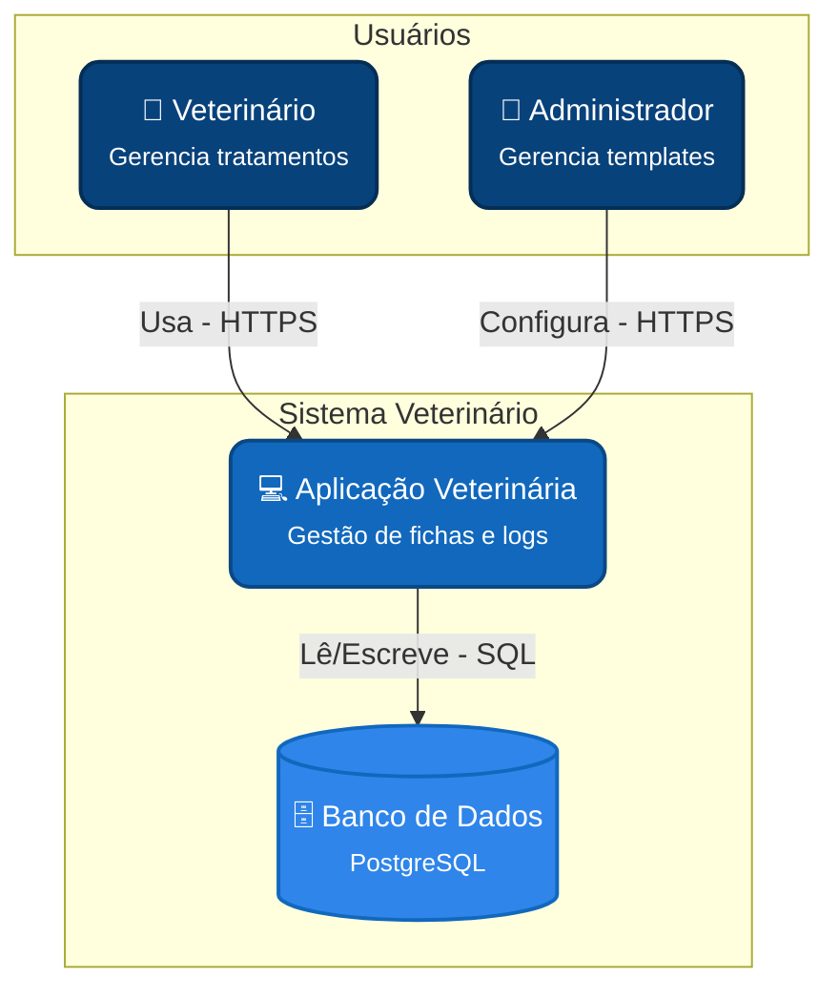
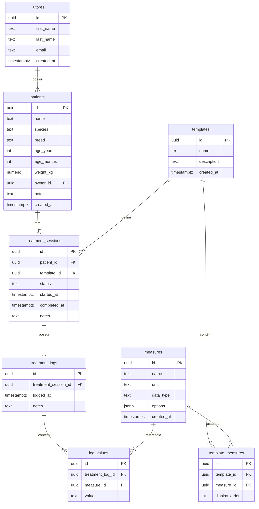
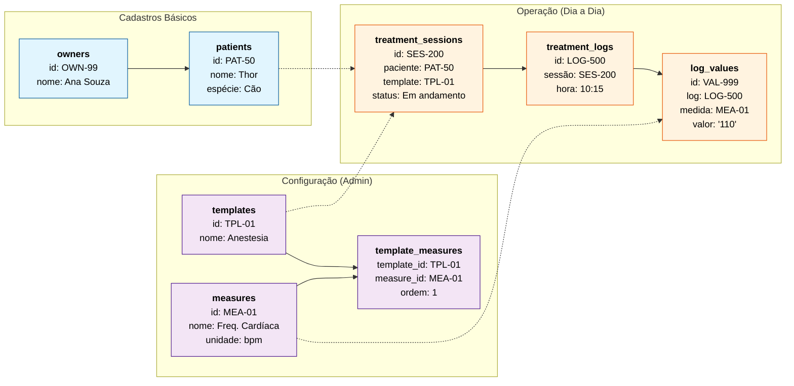

# Documentação do Projeto VetData

Este projeto consiste em uma aplicação para veterinários gerenciarem tratamentos e procedimentos, fornecendo fichas (templates) prontas e permitindo a coleta de medidas ao longo do tempo.

O sistema foca em flexibilidade, permitindo a criação de novos modelos (templates) de tratamento e medidas personalizadas.

---

## Estrutura do Sistema (C4 Model - Contexto)

O diagrama abaixo ilustra o contexto do sistema, seus usuários e o banco de dados.

---

## Esquema do Banco de Dados

O esquema atual foi desenhado para suportar a flexibilidade de templates e medidas dinâmicas. Abaixo está o diagrama de Entidade-Relacionamento (ER) seguido pela descrição detalhada das tabelas.

### Diagrama ER

### Detalhamento das Tabelas

Abaixo descrevemos o propósito de cada tabela e seus principais campos.

#### 1. `owners` (Proprietários/Tutores)

Armazena as informações das pessoas ou entidades responsáveis pelos animais.

- **id**: Identificador único.
- **first_name**, **last_name**: Nome do responsável.
- **email**: Contato principal.

#### 2. `patients` (Pacientes)

Armazena os dados dos animais atendidos.

- **id**: Identificador único.
- **owner_id**: Chave estrangeira ligando ao dono/proprietário.
- **species**, **breed**: Espécie e raça do animal.
- **age_years**, **age_months**: Idade detalhada.
- **weight_kg**: Peso do animal.

#### 3. `templates` (Modelos de Tratamento)

Define os tipos de tratamento disponíveis (ex: "Transfusão Sanguínea").

- **id**: Identificador único.
- **name**: Nome do tratamento.
- **description**: Descrição do procedimento.

#### 4. `measures` (Medidas)

Biblioteca de medidas que podem ser coletadas (ex: "Frequência Cardíaca", "Temperatura").

- **id**: Identificador único.
- **name**: Nome da medida.
- **unit**: Unidade de medida (ex: "bpm", "°C").
- **data_type**: Tipo do dado (texto, número, booleano, opção).
- **options**: Opções válidas se o tipo for seleção.

#### 5. `template_measures` (Medidas do Modelo)

Tabela de ligação que define quais medidas compõem um determinado template.

- **template_id**: O template.
- **measure_id**: A medida incluída.
- **display_order**: A ordem em que esta coluna aparece na ficha.

#### 6. `treatment_sessions` (Sessões de Tratamento)

Representa uma ficha "ativa" de um tratamento sendo aplicado a um paciente.

- **patient_id**: O paciente recebendo o tratamento.
- **template_id**: O modelo de tratamento sendo seguido.
- **status**: Estado atual (ex: "Em andamento", "Finalizado").

#### 7. `treatment_logs` (Registros/Linhas)

Cada entrada nesta tabela representa um momento no tempo onde medições foram feitas (uma linha na tabela do frontend).

- **treatment_session_id**: A sessão a qual este registro pertence.
- **logged_at**: Data e hora da medição.
- **notes**: Observações gerais sobre este momento.

#### 8. `log_values` (Valores)

Armazena o valor específico de uma medida em um determinado registro (uma célula na tabela do frontend).

- **treatment_log_id**: O registro temporal.
- **measure_id**: Qual medida está sendo registrada.
- **value**: O valor coletado (armazenado como texto para flexibilidade).

---

## Relacionamentos e Fluxo de Dados

Esta seção detalha como as tabelas interagem para suportar o fluxo de trabalho da clínica.

### 1. Gestão de Pacientes (`owners` ↔ `patients`)

- **Relacionamento**: Um para Muitos (1:N).
- **Explicação**: Um tutor (`owners`) pode ter vários animais (`patients`), mas cada animal pertence a apenas um responsável principal no cadastro.

### 2. Definição de Fichas (`templates` ↔ `measures`)

- **Relacionamento**: Muitos para Muitos (M:N), resolvido pela tabela `template_measures`.
- **Explicação**:
  - Um **Template** (ex: Transfusão) é composto por várias **Medidas** (ex: Frequência Cardíaca, Pressão).
  - Uma mesma **Medida** (ex: Frequência Cardíaca) pode ser reutilizada em diferentes Templates (ex: Anestesia, Transfusão).
  - A tabela `template_measures` une os dois, permitindo definir a ordem específica (`display_order`) das colunas para cada ficha.

### 3. Aplicação do Tratamento (`treatment_sessions`)

- **Relacionamento**: Conecta `patients` e `templates`.
- **Explicação**: Quando um médico inicia um tratamento, cria-se uma **Sessão** ligando um Paciente específico a um Template. Isso cria a "instância" da ficha para aquele animal.

### 4. Coleta de Dados (`treatment_sessions` ↔ `treatment_logs` ↔ `log_values`)

- **Estrutura Hierárquica**:
  1. **Sessão** (`treatment_sessions`): O documento do tratamento completo.
  2. **Log/Linha** (`treatment_logs`): Um registro temporal (ex: medição feita às 10:00). Uma Sessão terá muitos Logs ao longo do tempo (1:N).
  3. **Valor/Célula** (`log_values`): O dado individual. Um Log terá vários Valores (1:N), um para cada medida configurada no template.
- **Metadados**: Cada `log_value` aponta diretamente para a definição da `measure`, garantindo integridade e permitindo saber que o valor "120" refere-se a "BPM", por exemplo.

---

## Exemplo Visual com Dados (Instâncias)

Para facilitar o entendimento de como os dados se conectam na prática, o diagrama abaixo simula **uma linha** de cada tabela para um cenário real:
_O cachorro **Thor**, da tutora **Ana**, passando por uma **Anestesia**, onde foi medido **110 bpm** de Frequência Cardíaca às **10:15**._

---

## Protótipos (Wireframes)

Abaixo estão os esboços da interface do usuário para as principais funcionalidades.

