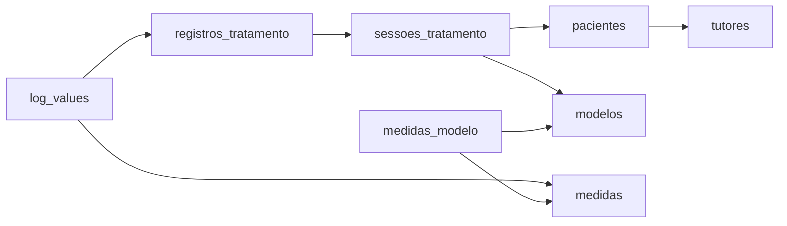
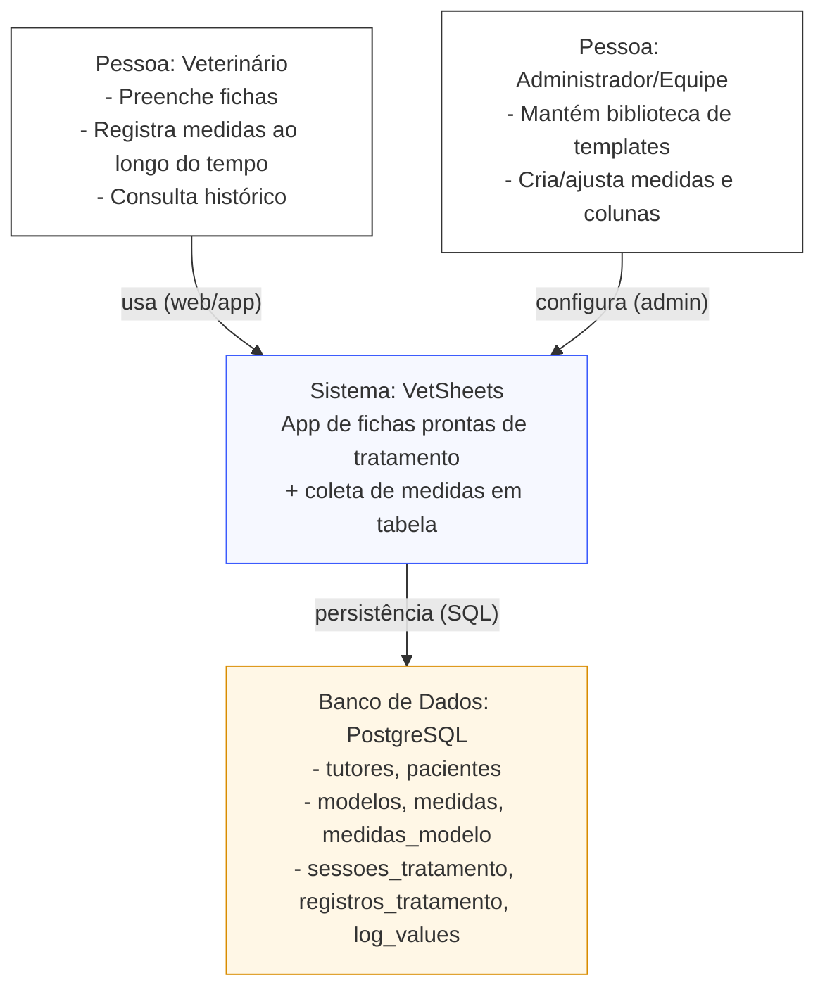

# Esquema de Banco de Dados — App Veterinária (Templates de Tratamento + Logs)

Este documento descreve, em profundidade, as **tabelas**, **campos** e **relacionamentos** do esquema de banco de dados do aplicativo para veterinários.  
O produto fornece **fichas prontas (templates)** para tratamentos e procedimentos (ex.: **transfusão sanguínea**) e permite coletar **medidas ao longo do tempo** em formato de **tabela** (colunas = medidas; linhas = registros no tempo).

---

## Diagrama Mermaid — Fluxo (tabelas conectadas)

> Diagrama simples e compatível com Mermaid **11.12.2**.

---

## Diagrama Mermaid — C4-style (Contexto)

> Este é um diagrama **C4-style** feito em Mermaid **usando apenas `flowchart`** (mais compatível entre renderizadores).  
> A ideia é comunicar “quem usa”, “o que é o sistema” e “onde os dados vivem”.

---

## Conceitos-chave do modelo de dados

### Template (Modelo) vs Sessão de Tratamento
- **modelo**: o “molde” do formulário (ex.: “Transfusão Sanguínea”) — define **quais colunas (medidas)** existem e em que ordem.
- **sessao_tratamento**: a aplicação do modelo para um **paciente específico** (ex.: “Transfusão do Bob em 24/12”).

### Linha vs Célula (tabela de coleta)
- **registro_tratamento**: representa uma **linha** da tabela (um momento de coleta).
- **log_values**: representa as **células** da linha (valores por medida).

---

## Tabelas e campos (detalhamento)

> Convenção: `PK` = chave primária, `FK` = chave estrangeira.

### 1) `tutores` — Responsável pelo paciente
Armazena o responsável (pessoa ou entidade) vinculado ao paciente.

**Campos**
- `id` (uuid, **PK**) — Identificador único do tutor.
- `first_name` (text) — Primeiro nome do responsável.
- `last_name` (text) — Sobrenome do responsável.
- `email` (text) — E-mail principal (útil para comunicação e identificação).
- `created_at` (timestamptz) — Data/hora de criação do registro.

**Relacionamentos**
- 1 tutor **possui N** pacientes: `pacientes.owner_id` → `tutores.id`

**Notas de modelagem**
- Para responsáveis “entidade”, `first_name/last_name` podem representar nome/razão social; se necessário, evolui para um campo específico no futuro.

---

### 2) `pacientes` — Cadastro do animal
Representa o paciente (animal) que será associado a fichas e sessões.

**Campos**
- `id` (uuid, **PK**) — Identificador único do paciente.
- `name` (text) — Nome do animal.
- `especie` (text) — Espécie (ex.: cão, gato).
- `raca` (text) — Raça.
- `idade_anos` (integer) — Idade em anos (quando disponível).
- `idade_meses` (integer) — Idade em meses (quando disponível).
- `peso_kg` (numeric) — Peso em kg.
- `owner_id` (uuid, **FK**) — Tutor/responsável: referência para `tutores.id`.
- `notas` (text) — Observações gerais do paciente (alertas, histórico resumido).
- `created_at` (timestamptz) — Data/hora de criação.

**Relacionamentos**
- N pacientes **pertencem a 1** tutor: `owner_id` → `tutores.id`
- 1 paciente **possui N** sessões: `sessoes_tratamento.paciente_id` → `pacientes.id`

**Notas de modelagem**
- `idade_anos` e `idade_meses` dão flexibilidade; futuramente pode-se usar `data_nascimento` para maior precisão.

---

### 3) `modelos` — Templates de tratamento/procedimento
Define os templates prontos (“fichas”) para diferentes tratamentos/procedimentos.

**Campos**
- `id` (uuid, **PK**) — Identificador único do modelo.
- `nome` (text) — Nome do template (ex.: “Transfusão Sanguínea”).
- `descricao` (text) — Descrição/objetivo do template.
- `criado_em` (data_hora/datetime) — Data/hora de criação.

**Relacionamentos**
- 1 modelo **é composto por N** vínculos em `medidas_modelo` (`template_id`).
- 1 modelo **é usado por N** sessões: `sessoes_tratamento.modelo_id` → `modelos.id`

---

### 4) `medidas` — Catálogo de medidas (colunas possíveis)
Catálogo global de medidas reaproveitáveis em vários modelos.

**Campos**
- `id` (uuid, **PK**) — Identificador único da medida.
- `name` (text) — Nome da medida (ex.: “Frequência Cardíaca”).
- `unidade` (text) — Unidade (ex.: bpm, °C, mmHg), opcional para textos.
- `tipo_dado` (text) — Tipo esperado (ex.: número, texto, seleção, booleano).
- `opcoes` (jsonb) — Opções para medidas do tipo seleção (lista/estrutura).
- `ordem_exibicao` (integer) — Ordem “padrão” global (para listagens no admin).

**Relacionamentos**
- 1 medida **aparece em N** modelos via `medidas_modelo`.
- 1 medida **possui N** valores ao longo do tempo via `log_values.measure_id` → `medidas.id`.

**Notas de modelagem**
- `tipo_dado` + `opcoes` orientam validação e UI (ex.: dropdown, checkbox, input numérico).

---

### 5) `medidas_modelo` — Composição do template (modelo ↔ medidas)
Define as colunas de cada template e sua ordem.

**Campos**
- `id` (uuid, **PK**) — Identificador do vínculo.
- `template_id` (uuid, **FK**) — Referência para `modelos.id`.
- `measure_id` (uuid, **FK**) — Referência para `medidas.id`.
- `display_order` (integer) — Ordem da coluna dentro do template.

**Relacionamentos**
- N vínculos pertencem a 1 modelo: `template_id` → `modelos.id`.
- N vínculos pertencem a 1 medida: `measure_id` → `medidas.id`.

**Regras recomendadas**
- Não repetir a mesma medida no mesmo modelo.
- Manter `display_order` estável para garantir consistência visual.

---

### 6) `sessoes_tratamento` — Instância do template para um paciente
Representa uma ficha “aberta” baseada em um modelo, aplicada a um paciente.

**Campos**
- `id` (uuid, **PK**) — Identificador único da sessão.
- `paciente_id` (uuid, **FK**) — Referência para `pacientes.id`.
- `modelo_id` (uuid, **FK**) — Referência para `modelos.id`.
- `status` (text) — Estado (ativa, finalizada, etc.).
- `iniciado_em` (data_hora/datetime) — Início da sessão.
- `concluido_em` (data_hora/datetime) — Conclusão da sessão (quando aplicável).
- `notas` (text) — Observações gerais da sessão.

**Relacionamentos**
- N sessões pertencem a 1 paciente: `paciente_id` → `pacientes.id`.
- N sessões pertencem a 1 modelo: `modelo_id` → `modelos.id`.
- 1 sessão **gera N** registros: `registros_tratamento.treatment_session_id` → `sessoes_tratamento.id`.

---

### 7) `registros_tratamento` — Linha temporal de coleta (um momento)
Cada registro é um ponto no tempo (uma linha do formulário).

**Campos**
- `id` (uuid, **PK**) — Identificador do registro.
- `treatment_session_id` (uuid, **FK**) — Referência para `sessoes_tratamento.id`.
- `registrado_em` (data_hora/datetime) — Momento da coleta.
- `notas` (text) — Comentários do momento.

**Relacionamentos**
- N registros pertencem a 1 sessão: `treatment_session_id` → `sessoes_tratamento.id`.
- 1 registro **contém N** valores: `log_values.registro_tratamento_id` → `registros_tratamento.id`.

---

### 8) `log_values` — Valor por medida em um registro (célula)
Armazena o valor de uma medida para um registro específico.

**Campos**
- `id` (uuid, **PK**) — Identificador do valor.
- `registro_tratamento_id` (uuid, **FK**) — Referência para `registros_tratamento.id`.
- `measure_id` (uuid, **FK**) — Referência para `medidas.id`.
- `valor` (text) — Valor coletado (texto para suportar múltiplos tipos).

**Relacionamentos**
- N valores pertencem a 1 registro: `registro_tratamento_id` → `registros_tratamento.id`.
- N valores pertencem a 1 medida: `measure_id` → `medidas.id`.

**Regras recomendadas**
- Para evitar duplicidade de célula, garantir “uma medida por registro” (unicidade por par registro+medida).

---

## Como o esquema sustenta a “tabela” do formulário

- **Colunas**: medidas do modelo via `medidas_modelo` (ordenadas por `display_order`).
- **Linhas**: momentos de coleta via `registros_tratamento` (ordenados por `registrado_em`).
- **Células**: valores via `log_values` (uma célula por medida em cada registro).

Isso permite que o template defina o layout (colunas) e que os logs preencham a matriz ao longo do tempo.

---

## Recomendações de integridade e consistência (sem implementação)

- Unicidade:
  - Um modelo não deve repetir a mesma medida (vínculo único entre modelo e medida).
  - Um registro não deve conter dois valores para a mesma medida.
- Consistência de domínio:
  - Padronizar `status` e `tipo_dado` com um conjunto fixo de valores.
- Performance:
  - Índices em todas as chaves estrangeiras para consultas rápidas em telas de sessão/histórico.

---
